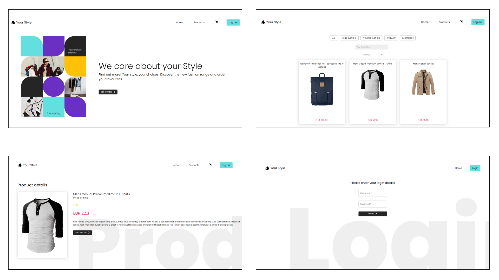

# Online Shopping React App

Responsive basic online store build with React Js, consuming Fake Store API.

## Getting started

$ git clone: https://Bianca_Marin12@bitbucket.org/radup-ensemble/tech-test-bianca-marin.git

$npm install (install node modules)

$npm start (start the server)

## Tech

- React Js
- React Router Dom
- React Hooks
- AJAX and Fetch API
- Styled with CSS, Material UI and Framer Motion

## Features

- Login functionality;

  - Username: mor_2314

  - Password: 83r5^\_

- Logout functionality;
- Only the user logged cand view the products;
- Filters on categories: All products, Men's Clothing, Women's Clothing, Jewelery and Electronics;
- Client-side search bar: display the products by title;
- Sorting method by price: ascending and descending;
- Cart component;
- Quick survey about the user preferences;
- Not Found Page;

## Illustration

Homepage/Login Page/Products/Product Details

